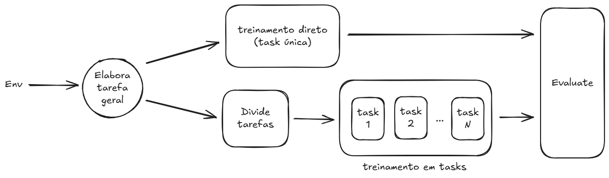

# 🧠 Curriculum Learning em Ambientes de Reinforcement Learning

## 📌 Objetivo do Projeto

Este projeto tem como objetivo investigar os efeitos da introdução de **Curriculum Learning (CL)** no processo de aprendizado por reforço. A proposta central é comparar o desempenho de agentes treinados com e sem o uso de um currículo progressivo de tarefas, avaliando o impacto sobre métricas relevantes como:

- ⏱️ **Tempo de convergência**
- 🎯 **Valor da recompensa na convergência**
- 🎲 **Entropia da política durante o treinamento**

## 🎓 O que é Curriculum Learning?

Curriculum Learning é uma estratégia de treinamento inspirada na forma como humanos aprendem: começando por tarefas simples e progredindo para tarefas mais complexas. No contexto de RL, isso pode significar começar com versões mais fáceis de um ambiente e gradualmente aumentar sua complexidade à medida que o agente melhora.

## 🔬 Metodologia

1. **Seleção de Ambientes**  
   Vamos selecionar os seguintes ambientes clássicos:
    - LunarLander-v3
    - BipedalWalker-v3

2. **Definição dos Currículos**  
   A investigação será feita colocando em paralelo o treinamento baseline (sem currículo) e o treinamento com currículo progressivo. Para tanto, vamos seguir o seguinte workflow:

   

### LunarLander-v3

Para o ambiente LunarLander-v3, o currículo será definido da seguinte forma:
```python
lunarlander_stages = [
    {
        "name": "easy",
        "gravity": -5.0,
        "enable_wind": False,
        "wind_power": 0.0,
        "turbulence_power": 0.0,
        "parcial_timesteps": 500_000,
    },
    {
        "name": "intermediate",
        "gravity": -10.0,
        "enable_wind": False,
        "wind_power": 0.0,
        "turbulence_power": 0.0,
        "parcial_timesteps": 500_000,
    },
    {
        "name": "hard_with_wind",
        "gravity": -10.0,
        "enable_wind": True,
        "wind_power": 5.0,
        "turbulence_power": 0.5,
        "parcial_timesteps": 500_000,
    },
    {
        "name": "full_difficulty",
        "gravity": -10.0,
        "enable_wind": True,
        "wind_power": 15.0,
        "turbulence_power": 1.5,
        "parcial_timesteps": 500_000,
    }
]
```
### BipedalWalker-v3

Para o ambiente BipedalWalker-v3, o currículo será definido da seguinte forma:
```python
bipedal_stages = [
    {
        "name": "easy",
        "hardcore": False,
        "parcial_timesteps": 1_000_000,
    },
    {
        "name": "hardcore",
        "hardcore": True,
        "parcial_timesteps": 1_000_000,
    },
]
```

## 📈 Métricas Avaliadas

- **Tempo de convergência**: Número de episódios até estabilização da recompensa média.
- **Recompensa final**: Valor médio da recompensa nas últimas N iterações.
- **Entropia da política**: Avaliação da aleatoriedade das decisões ao longo do tempo (quanto menor, mais determinística a política).

## 🧪 Resultados Esperados

A hipótese é que o uso de curriculum learning:
- Reduzirá o tempo de convergência,
- Permitirá alcançar recompensas mais altas (melhor política final),
- Promoverá políticas menos aleatórias, com entropia decrescente de forma mais estável.

## 🧪 Resultados Obtidos

### Tempo de convergência

Não foi afetado pelo uso de curriculum learning, para mais detalhes veja o relatório completo no PDF disponível na pasta `docs`.

### Recompensa final

O uso de curriculum learning não trouxe resultados significativos, para mais detalhes veja o relatório completo no PDF disponível na pasta `docs`.

### Entropia da política

O uso de curriculum learning para o caso do BipedalWalker-v3 trouxe resultador coerentes com a hipótese inicial. Para mais detalhes veja o relatório completo no PDF disponível na pasta `docs`.

## 📄 Códigos e artefatos

Você pode encontrar os códigos de execução nos notebooks disponíveis na raiz do diretório. Além disso, é possível encontrar os artefatos gerados durante a execução dos experimentos nas pastas `results` e `saved_models`. 

## 📚 Notebooks de inferência

Por fim, você pode usar o notebook `inference.ipynb` para realizar inferências com os modelos treinados. Basta executar o notebook e seguir as instruções para carregar os modelos e realizar inferências nos ambientes selecionados.